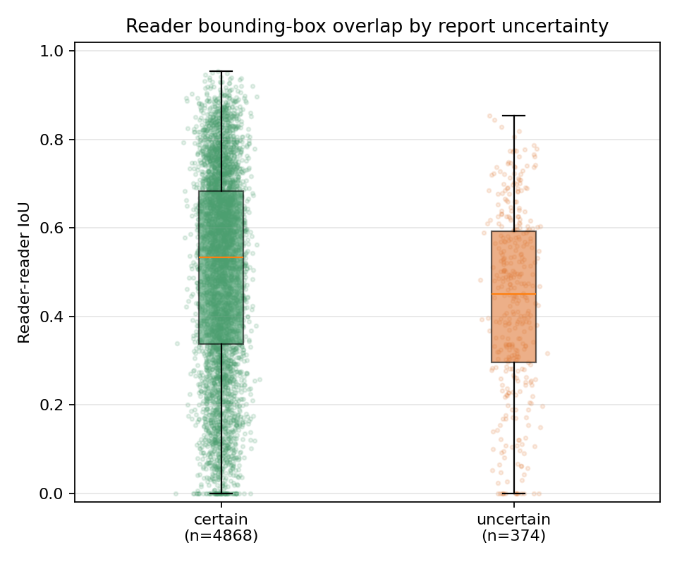
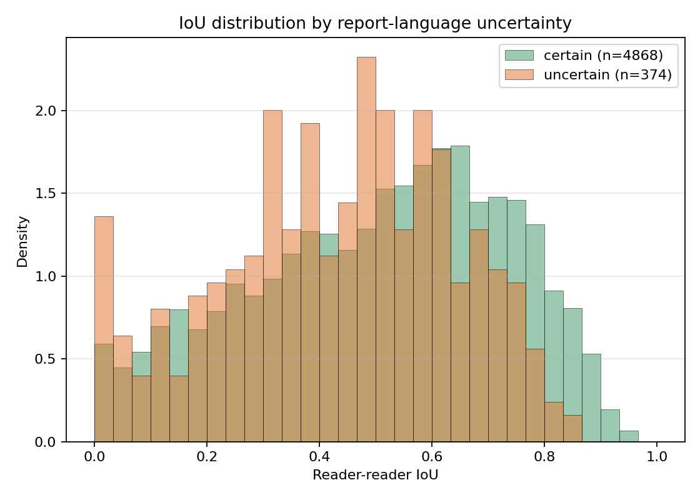
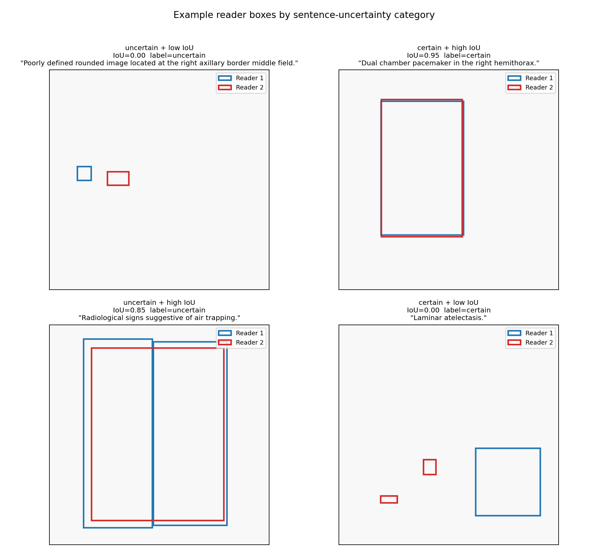

# Rule-based bag-of-words uncertainty classifier
## Report-language uncertainty vs. radiologist spatial disagreement (PadChest-GR)

**Branch:** `rule-bag-of-words`
**Commit:** `766ac42`
**Dataset:** PadChest-GR — every positive grounded finding sentence with bounding boxes from **both** readers.
**N samples:** 5,242

---

## 1. Method

For each sentence we apply a simple, deterministic substring-matching classifier:

```python
def rule_based_classify(sentence):
    s = sentence.lower()
    triggers = [t for t in UNCERTAIN_TERMS if t in s]
    return "uncertain" if triggers else "certain"
```

If the sentence contains **any** phrase from the dictionary below, it is labeled `uncertain`; otherwise `certain`. No language model is used.

We then compute reader-vs-reader mask IoU on a 1024×1024 raster of the union of each reader's boxes, and compare the IoU distribution of the two groups.

---

## 2. The hedge-word dictionary used to filter

We labeled a sentence as **uncertain** if it contained any of these **47 phrases** (case-insensitive substring match). The list combines diagnostic hedges (about *whether* / *what* the finding is) and spatial hedges (about *where* / *how clearly delineated* the finding is).

### 2.a Diagnostic hedges (uncertainty about presence or identity)

```
possible            possibly
probable            probably
likely
questionable        equivocal
may represent       could represent
may correspond      could correspond
may be              might
appears             apparent
cannot exclude      can't exclude
cannot be excluded  cannot rule out
difficult to exclude
difficult to assess
suspicious for      suspicion of
suggestive of       suggesting       suggests
compatible with     consistent with
rule out            to rule out
vs                  versus
```

### 2.b Spatial / boundary / visibility hedges (uncertainty about delineation)

```
ill-defined         ill defined
poorly defined      poorly-defined
ill-circumscribed   ill circumscribed
indistinct          vague
subtle              faint
hazy                blurred       blurry      fuzzy
obscured
barely visible
```

(Source of truth: `UNCERTAIN_TERMS` in `project/src/medgemma_uncertainty.py`.)

---

## 3. Main result

| Group     | n     | mean IoU | 95 % CI            | median | std    |
|-----------|------:|---------:|-------------------:|-------:|-------:|
| certain   | 4,868 | **0.504** | [0.497, 0.510]   | 0.533  | 0.228  |
| uncertain |   374 | **0.432** | [0.411, 0.452]   | 0.450  | 0.207  |
| **Δ = certain − uncertain** | | **+0.071** | [0.050, 0.093] | | |

Uncertain share of corpus: **7.1 %** (374 / 5,242).

### Statistical tests

| Test                            | Value                         |
|---------------------------------|-------------------------------|
| Mann–Whitney U (one-sided cert > unc) | U = 1,083,386, **p = 4.2 × 10⁻¹⁰** |
| Mann–Whitney U (two-sided)      | p = 8.4 × 10⁻¹⁰              |
| Bootstrap Δ mean (2,000 reps)   | 0.071, 95 % CI [0.050, 0.093] |
| Permutation Δ (5,000 reps)      | p ≈ 0.0002                    |

### Regression — control for finding type and box area

`reader_iou ~ is_uncertain + C(finding_label) + log(union_area)`

| term                 | coefficient | SE     | p-value |
|----------------------|------------:|-------:|--------:|
| **is_uncertain**     | **−0.009**  | 0.012  | **0.43** |
| log(union_area)      | −0.083      | —      | —       |
| intercept            |  1.378      | —      | —       |
| (n finding categories) | 144       |        |         |

**Interpretation:** the marginal effect of uncertain language vanishes once we control for which finding it describes and how large the boxes are. Most of the raw Δ = 0.071 IoU gap is explained by the fact that uncertain language is concentrated in finding categories that are inherently harder to delineate.

---

## 4. Figures

### 4.a Reader–reader IoU by report-language uncertainty (boxplot + strip)


### 4.b IoU distribution by group (normalized histograms)


### 4.c Example grid — extreme cases


(Quadrants: uncertain + low IoU, certain + high IoU, uncertain + high IoU, certain + low IoU. Reader 1 boxes in blue, reader 2 boxes in red, both rasterized into a unit canvas.)

---

## 5. Per-finding control analysis (≥10 in each group)

| finding label              | n_cert | n_unc | mean IoU (cert) | mean IoU (unc) |     Δ |
|----------------------------|-------:|------:|----------------:|---------------:|------:|
| callus rib fracture        |     88 |    11 |          0.359  |        0.259   | **+0.100** |
| increased density          |     70 |    12 |          0.442  |        0.378   | **+0.064** |
| alveolar pattern           |    116 |    12 |          0.478  |        0.446   | +0.033 |
| pseudonodule               |     64 |    16 |          0.324  |        0.293   | +0.031 |
| vascular hilar enlargement |     65 |    93 |          0.489  |        0.491   |   ≈ 0  |
| infiltrates                |    105 |    23 |          0.462  |        0.488   | -0.026 |
| pleural effusion           |    157 |    17 |          0.418  |        0.475   | -0.057 |
| atelectasis                |     49 |    12 |          0.421  |        0.525   | **-0.103** |
| calcified granuloma        |     66 |    10 |          0.275  |        0.406   | **-0.131** |
| nipple shadow              |     30 |    13 |          0.182  |        0.350   | **-0.168** |

4 of 10 categories support the hypothesis; 1 is neutral; 5 invert. Consistent with the null regression coefficient.

---

## 6. 15 random *uncertain* examples (rule-based)

| # | finding | IoU | sentence | trigger |
|--:|---------|----:|----------|---------|
|  1 | vascular hilar enlargement | 0.64 | Prominent hila of probable vascular origin. | probable |
|  2 | goiter | 0.49 | Consistent with goiter. | consistent with |
|  3 | sclerotic bone lesion | 0.22 | Sclerotic image in the left humeral head, in relation to a probable enchondroma… | probable |
|  4 | pseudonodule | 0.63 | A pseudonodular image persists in the right hilum, likely of vascular etiology. | likely |
|  5 | loculated pleural effusion | 0.78 | Right basal image suggestive of loculated pleural effusion. | suggestive of |
|  6 | vascular hilar enlargement | 0.50 | Prominent hila of probable vascular origin. | probable |
|  7 | alveolar pattern | 0.53 | Diffuse bilateral interstitial-alveolar pattern …, likely of inflammatory/infectious… | likely |
|  8 | vascular hilar enlargement | 0.43 | Prominent hila of probable vascular etiology. | probable |
|  9 | pleural effusion | 0.61 | Increased basal density on the right, suggestive of pleural effusion. | suggestive of |
| 10 | goiter | 0.49 | Probably related to goiter. | probably |
| 11 | vascular hilar enlargement | 0.58 | Prominent left hilum, probably of vascular origin. | probably |
| 12 | nodule | 0.00 | Nodular image in the left middle lung field, likely of bone origin, osteochondroma. | likely |
| 13 | vascular hilar enlargement | 0.57 | With prominent hila of probable vascular origin. | probable |
| 14 | laminar atelectasis | 0.05 | Subsegmental LM atelectasis associated with an increase in right paracardiac density with **poorly defined** borders. | poorly defined |
| 15 | infiltrates | 0.60 | Increased density at the left base likely related to fatty infiltration. | likely |

Every trigger is a real hedge word — no false-positive noise.

## 7. 15 random *certain* examples (rule-based)

| # | finding | IoU | sentence |
|--:|---------|----:|----------|
|  1 | laminar atelectasis | 0.29 | Left basal laminar atelectasis. |
|  2 | interstitial pattern | 0.42 | Diffuse bilateral interstitial pattern. |
|  3 | mastectomy | 0.57 | Bilateral mastectomy. |
|  4 | hilar enlargement | 0.65 | Enlargement of the right hilum. |
|  5 | tracheal shift | 0.45 | Displacement of the lateral wall of the trachea. |
|  6 | surgery neck | 0.33 | Changes from cervical surgery. |
|  7 | vertebral degenerative changes | 0.77 | Signs of spondylosis in the spine included in the study. |
|  8 | cardiomegaly | 0.72 | Increased cardiothoracic index. |
|  9 | apical pleural thickening | 0.53 | Known right apical pleural thickening. |
| 10 | consolidation | 0.44 | Consolidation. |
| 11 | cardiomegaly | 0.86 | Global cardiomegaly. |
| 12 | hilar enlargement | 0.61 | Prominent hila. |
| 13 | scoliosis | 0.36 | Thoracolumbar scoliosis. |
| 14 | infiltrates | 0.43 | Right basal infiltrates. |
| 15 | aortic elongation | 0.41 | Aortic elongation. |

All declarative anatomy / finding statements — appropriate certain examples.

---

## 8. Comparison to MedGemma (spatial-only prompt)

|                                   | MedGemma spatial prompt | Rule bag-of-words |
|-----------------------------------|------------------------:|------------------:|
| uncertain share of corpus         |                  20.6 % |          **7.1 %** |
| mean IoU certain                  |                   0.517 |             0.504 |
| mean IoU uncertain                |                   0.427 |             0.432 |
| Δ mean IoU (cert − unc)           |          +0.090 [0.075, 0.105] | +0.071 [0.050, 0.093] |
| Mann–Whitney p (one-sided)        |          2.3 × 10⁻³¹    |    4.2 × 10⁻¹⁰    |
| permutation p                     |                ≈ 0.0002 |          ≈ 0.0002 |
| regression β_uncertain (controlled) |       −0.008 (p = 0.31) | −0.009 (p = 0.43) |
| trigger quality (manual review)   | noisy (flags `at`, `basal`, `air trapping`, `probable`) | clean — every trigger is a real hedge |

Both classifiers reach the **same scientific conclusion**: the marginal effect of uncertain language on reader IoU is real and very statistically significant, but it disappears after controlling for finding type — i.e. report-language uncertainty is largely a proxy for *which findings* tend to be hard to delineate, not an independent driver of spatial disagreement.

---

## 9. Conclusions

1. Reports flagged by the bag-of-words classifier as **uncertain** show ~7 % lower mean inter-reader IoU than reports flagged as **certain** (Δ = 0.071, 95 % CI [0.050, 0.093], p < 10⁻⁹). The marginal hypothesis is supported.
2. After adjusting for **finding label** and **box-union area**, the effect of uncertainty is **not statistically significant** (β = −0.009, p = 0.43). The marginal Δ is confounded with finding type.
3. Direction is mixed inside individual findings (4 / 10 support, 1 / 10 neutral, 5 / 10 invert).
4. MedGemma's spatial-only LLM prompt and the simple bag-of-words rule give qualitatively identical conclusions — and the bag-of-words baseline produces visibly cleaner triggers.

This is a strong motivation to move from *report-language* uncertainty (a noisy proxy for finding type) to *model-derived* spatial uncertainty (e.g., BioViL-T attention entropy or MedSAM mask-probability variance) in the next stage of the project: a model that disagrees with itself spatially is much more likely to predict *where* readers disagree than a sentence containing the word "probable."

---

*Generated locally on a MacBook in ~10 seconds; no GPU required. Reproduce with:*

```bash
git checkout rule-bag-of-words
cd project/src
python3 run_pipeline.py --scorer rule --skip_load
```
